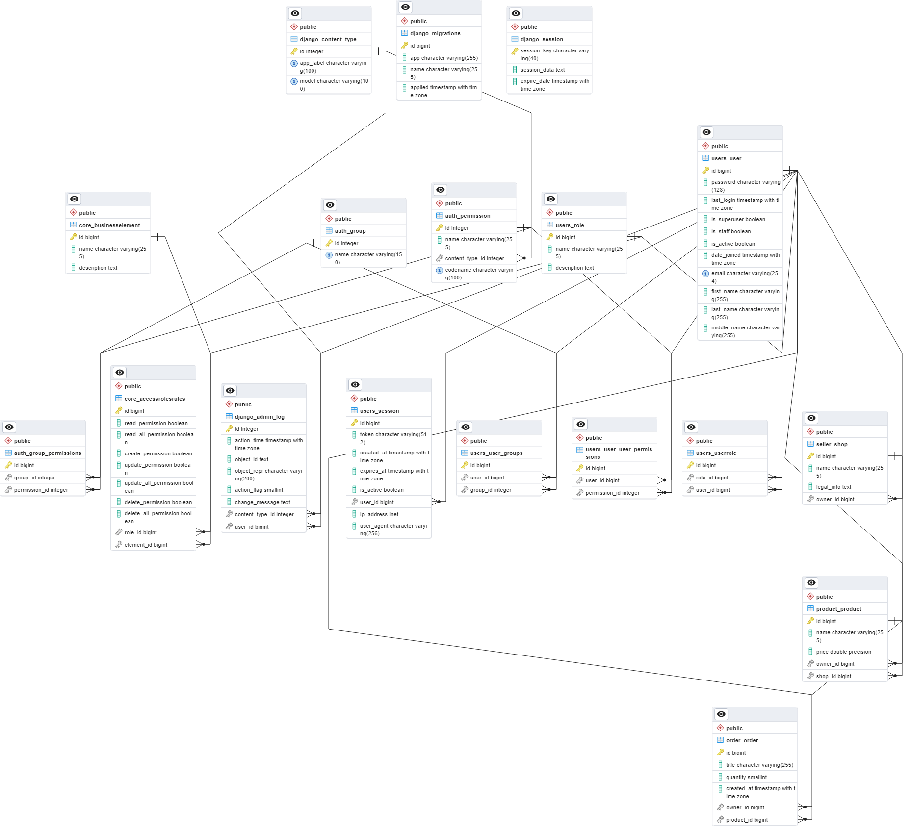

## Инструкция по установке:

1. Склонируйте репозиторий и перейдите в папку проекта:

```bash
git clone <URL_репозитория>
cd my_shop
```
2. создать собственное окружение, используйте .env.example как шаблон:

```bash
cp .env.example .env
```

3. Убедитесь, что установлен Docker и Docker Compose.

4. Запустите контейнеры

``` bash
docker-compose up -d
```

5. Примените миграции и суперпользователя

```bash
docker-compose exec web python manage.py migrate
docker-compose exec web python manage.py createsuperuser
```

6. Swagger / DRF API доступен по адресу:
 http://localhost:8001/api/docs/#/

7. Админ панель Джанго доступна по адресу: http://localhost:8001/admin/

## О приложении

My Shop - REST API для управления пользователями, магазинами, товарами и заказами с ролевой моделью доступа (RBAC).





# Архитектура

#### Логическая схема компонентов

```
Login endpoint
→ создаёт JWT + Session

JWTTokenAuthentication (DRF authentication class)
→ извлекает токен из Authorization: Bearer <token>
→ декодирует JWT
→ проверяет активность сессии (Session.is_active)
→ проверяет, что пользователь активен (user.is_active)
→ подставляет request.user

Permission classes (IsCustomAuthenticated + RolePermission)
→ проверяют права доступа к эндпоинту и объекту

Logout endpoint
→ деактивирует активные Session

Soft delete endpoint
→ помечает user как is_active=False
→ деактивирует все его Session

```

#### Ответственность компонентов

| Компонент              | Ответственность                                                     |
| ---------------------- | ------------------------------------------------------------------- |
| Login View             | Аутентификация: проверка email/пароля, создание JWT и Session       |
| JWTTokenAuthentication | Проверка токена и сессии, присвоение request.user                   |
| Permission classes     | Авторизация: проверка прав по ролям и владельцу объекта (RBAC)      |
| Logout View            | Инвалидировать токен/деактивировать сессии                          |
| Delete View            | Мягкое удаление пользователя (is_active=False) + деактивация сессий |
## База данных

**UserRole** — таблица **M:N**, связывает пользователей и роли. Хранит, какие роли назначены пользователям.

**Роли:**

- **Admin** → полный доступ ко всем сущностям (пользователи, заказы, товары, настройки).
    
- **Manager** → управление товарами.
    
- **Seller** → доступ только к своим магазинам и объектам.
    
- **User** → создание и просмотр своих заказов, редактирование своего профиля.
    
- **Guest** → только просмотр публичной информации.


Все бизнес-таблицы имеют поле `owner_id → User.id`.

**Пример:**

- `Order(id, title, owner_id, product_id, quantity, created_at)`
    

Проверка доступа:

- `update_permission=True` → редактирование **только своих** объектов.
    
- `update_all_permission=True` → редактирование **любых объектов**.

## Структура проекта
```
my_shop/
├─ manage.py
├─ my_shop/
│  ├─ settings.py
│  ├─ urls.py
│  └─ ...
│
├─ apps/
│  ├─ users/
│  │  ├─ models.py          # User, Role, UserRole, Session
│  │  ├─ serializers.py
│  │  ├─ views.py
│  │  ├─ permissions.py     # RolePermission, IsCustomAuthenticated
│  │  └─ urls.py
│  │
│  ├─ seller/
│  │  ├─ models.py          # Shop
│  │  ├─ serializers.py
│  │  ├─ views.py
│  │  └─ urls.py
│  │
│  ├─ product/
│  │  ├─ models.py          # Product
│  │  ├─ serializers.py
│  │  ├─ views.py
│  │  └─ urls.py
│  │
│  └─ order/
│     ├─ models.py          # Order
│     ├─ serializers.py
│     ├─ views.py
│     └─ urls.py
│
├─ core/                   # Общие вещи
│  ├─ models.py            # BusinessElement, AccessRolesRules
│  ├─ permissions.py       # GenericPermission, RBACListModelViewSet
│  └─ ...
├─ requirements.txt
└─ README.md

```

## Аутентификация

Используется JWT + кастомная модель **Session**.

### JWTTokenAuthentication

- Берёт токен из заголовка `Authorization: Bearer <token>`
    
- Проверяет валидность и активность сессии (`session.is_active`)
    
- Подставляет `request.user` или оставляет `AnonymousUser`
    

### Модель Session

- `user` — ссылка на пользователя
    
- `token` — JWT
    
- `created_at`, `expires_at`
    
- `is_active` — активность токена
    
- `user_agent`, `ip_address` — данные клиента
    

Swagger автоматически подставляет поле **tokenAuth (http, Bearer)** для проверки защищённых эндпоинтов.


## Авторизация

**RolePermission** и **AccessRolesRules** контролируют доступ к любому бизнес-элементу.

Права:

|Действие|Права|Описание|
|---|---|---|
|Read|`read_permission` / `read_all_permission`|Просмотр своих или всех объектов|
|Create|`create_permission`|Создание объектов|
|Update|`update_permission` / `update_all_permission`|Редактирование своих или всех объектов|
|Delete|`delete_permission` / `delete_all_permission`|Удаление своих или всех объектов|

Используется **RBACListModelViewSet** для ограничения списка объектов на основе ролей пользователя.

### IsCustomAuthenticated — проверка авторизации через JWT

```
Client → Request с заголовком Authorization: Bearer <token>
  ↓
IsCustomAuthenticated.has_permission
  - проверка наличия заголовка и формата
  - проверка, что request.user авторизован
  ↓
Разрешение доступа к эндпоинту
  ↓
Если токен отсутствует или пользователь не авторизован → 401 Unauthorized
```


### RolePermission — контроль доступа по ролям и владельцу объекта

**View-level (has_permission)**:
```
Client → Request к эндпоинту
  ↓
RolePermission.has_permission
  - Superuser → полный доступ
  - Не авторизован → доступ только для allow_guest=True
  - Определение бизнес-элемента (view/queryset)
  - Проверка, зарегистрирован ли элемент в BusinessElement
  - Определение нужного permission по HTTP-методу
  - Получение ролей пользователя и AccessRolesRules
  ↓
Разрешение доступа, если хотя бы одно правило позволяет действие
  ↓
Если нет прав → 403 Forbidden
```

**Object-level (has_object_permission)**:

```
Client → Request к объекту (например, Order, Product)
  ↓
RolePermission.has_object_permission
  - Superuser → полный доступ
  - Определение бизнес-элемента через объект
  - Определение владельца объекта (owner)
  - Получение ролей пользователя и AccessRolesRules
  ↓
Проверка прав:
    *_all_permission → доступ ко всем объектам
    *_permission + владелец → доступ к своим объектам
  ↓
Если права не подходят → 403 Forbidden
```

## Работа с пользователями

### 1. Регистрация

Endpoint: `/api/users/register`  
Метод: `POST` (публичный)

- Ввод: имя, email, пароль, подтверждение пароля
    
- Валидация пароля и email
    
- Хеширование через bcrypt
    
- Автоматическое назначение роли **User**
    
- Ответ: `201 Created` + данные пользователя

```
Client → POST /api/users/register → UserViewSet.register → UserSerializer → create → assign role=User → 201 Created

```

### 2️. Вход (Login)

Endpoint: `/api/users/login`  
Метод: `POST`

- Ввод: email и пароль
    
- Проверка существования пользователя, активности и корректности пароля
    
- Генерация JWT + создание сессии
    
- Ответ: `token`, `user_id`, `email`

```
Client → POST /api/users/login → LoginSerializer → UserViewSet.login → Session → 200 OK
```


### 3️. Выход (Logout)

Endpoint: `/api/users/logout`  
Метод: `POST` (требует авторизации)

- Деактивация всех сессий пользователя с текущим токеном
    
- Ответ: `200 OK {"detail": "Successfully logged out"}`

```
Client → POST /api/users/logout → deactivate Session → 200 OK
```


### 4️. Удаление пользователя

Endpoint: `/api/users/delete`  
Метод: `POST` (требует авторизации)

- Мягкое удаление: `is_active=False`
    
- Деактивация всех сессий
    
- Ответ: `200 OK {"detail": "User soft-deleted"}`

```
Client → POST /api/users/delete → UserViewSet.delete → soft delete + deactivate Session → 200 OK
```


### 5. Обновление информации пользователя

**Endpoint:** `/users/update_profile/` (`PUT` / `PATCH`)

**Permissions:** `[IsCustomAuthenticated, RolePermission]`

**Последовательность:**

```
Client
  ↓
PUT/PATCH /users/update_profile/ (Authorization: Bearer <token>)
  ↓
IsCustomAuthenticated
    - проверка JWT
    - если токен невалидный → 401 Unauthorized
  ↓
RolePermission
    - проверка роли пользователя и владельца объекта
    - если нет прав → 403 Forbidden
  ↓
UpdateProfileSerializer
    - валидация входных данных
    - проверка уникальности email (если меняется)
  ↓
UserViewSet.update_profile
    - частичное или полное обновление полей пользователя
  ↓
Response
    - 200 OK + обновлённые данные
    - или ошибки 400/401/403
```


### 6. Управление правами доступа администратора

**Endpoints:** CRUD для ролей и правил доступа (`Role`, `AccessRolesRules`)

**Последовательность:**

```
Admin Client
  ↓
GET/POST/PUT/PATCH/DELETE /api/roles/ или /api/access_rules/ (Authorization: Bearer <admin token>)
  ↓
IsCustomAuthenticated
    - проверка JWT
    - если токен невалидный → 401 Unauthorized
  ↓
RolePermission
    - проверка, что пользователь — администратор
    - если нет прав → 403 Forbidden
  ↓
Role/AccessRolesRules Serializer
    - валидация данных (название роли, права, CRUD операции)
  ↓
ViewSet
    - выполнение операции CRUD на Role или AccessRolesRules
  ↓
Response
    - 200 OK / 201 Created / 204 No Content
    - или ошибки 400/401/403

```
#### Управление ролями и доступом (Admin)

- Endpoint: `/api/admin-roles/`
    
- Роли администратора управляют ролями и правилами доступа
    

**Возможности:**

- Получить роли пользователя (`list_user_roles`)
    
- Назначить роль (`assign_role`)
    
- Удалить роль (`remove_role`)
    
- Просмотр всех правил доступа (`access_rules`)
    

**Примеры запросов и ответов описаны через Swagger/OpenAPI.**


##  Работа с магазинами, товарами и заказами

- `ProductViewSet` → CRUD для товаров, права проверяются через `RolePermission` + `owner`
    
- `OrderViewSet` → CRUD для заказов, доступ только к своим заказам при `read_permission=True`
    


